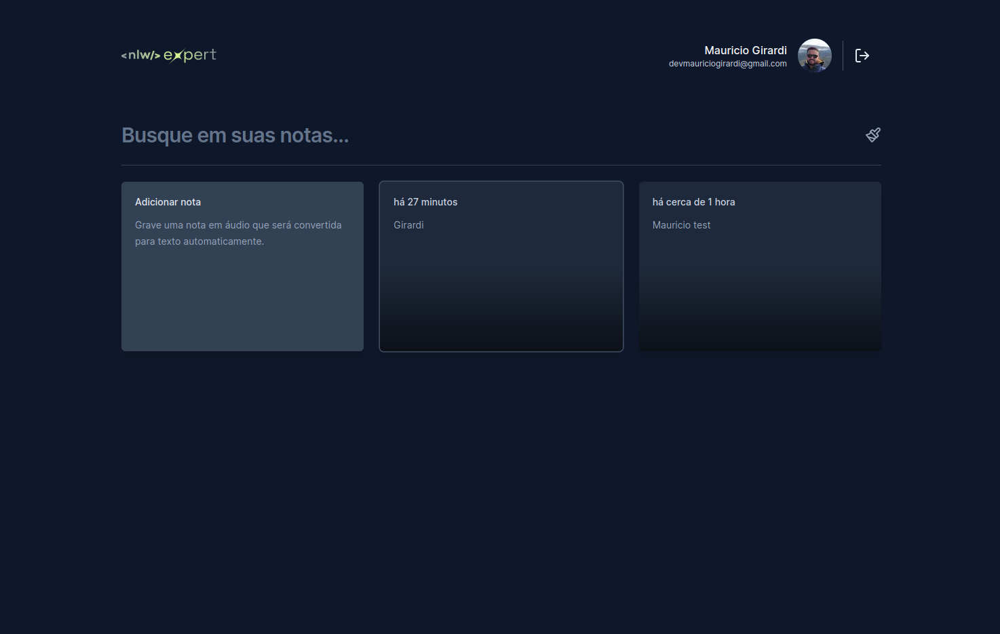
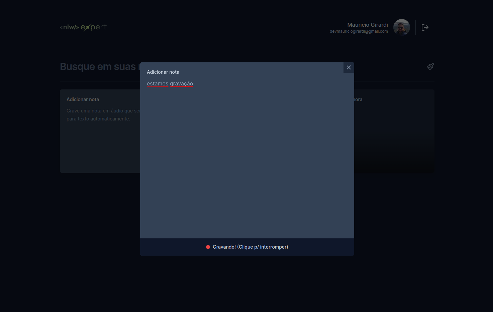

<h1 align="center">notetalk</h1>

<p align="center">


</p>

### Descrição

Durante a NLW, desenvolvemos este aplicativo de nota que permite ao usuário criar uma nota por digitação ou por áudio.

### Clonar o projeto

```bash
# clone
git clone https://github.com/mauriciogirardi/note.git

# open folder
cd note

# install
npm i

# need to create a authentication firebase Google
https://firebase.google.com/?hl=pt

# create .env.local file and copy .env.example file

# run
npm run dev
```

### Layout




## Todo

- [ ] Add unit test.
- [ ] Create api to save the notes.

---


